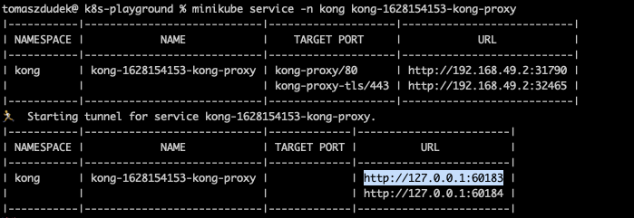

# Co zrobione zostało
* `minikube start`
* `helm repo add kong https://charts.konghq.com`
* `helm repo update`

tu uwaga poniżej bo może się stworzyć w defaultowym namespace a chcemy w `kong`
* `helm install kong/kong --generate-name --set ingressController.installCRDs=false -n kong --generate-namespace`
* `kubectl apply -f kong/service.yml`
* `kubectl apply -f kong/proxy.yml

teraz trzeba znaleźć w UI minikube/czegoś nazwę service (ponieważ instalowaliśmy go helmem), w moim przypadku było to `kong-1628154153-kong-proxy`
a następnie użyć `minikube service -n kong <nazwa service>` i wyczytać adres (zaznaczony na skrinie)

* `export PROXY_IP=http://127.0.0.1:60183` <--- tu ofc to co jest u ciebie
* `curl -i -H "Host: example.com" $PROXY_IP/bar/sample` powinno dać 200 wraz z hostname, pod information i innymi dziwadłami

włala